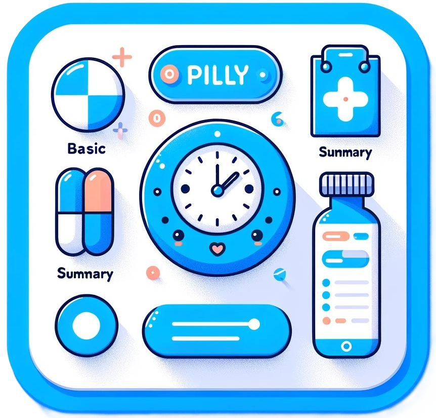

</img>

Welcome to my GitHub profile! As a software engineer, I thrive on collaborating with developers who share my passion, dedication, and keen eye for meticulous design. Although my focus is in android, I'm always looking to venture out and explore new platforms. Whether it's crafting flashy websites or leveraging cutting edge apis like Google Vision, I'm always looking to learn. 

To me, the user experience is paramount; customizing it requires an agile mindset as well as a knack for teaching myself new technologies. Below, you'll see a variety of projects that I've single-handedly taken from concept to launch, alongside contributions I've made to open-source initiatives. Whether you're interested in collaborating or just want to talk some tech, feel free to reach out. 
<a align ="center" href="https://www.linkedin.com/in/profile-abhat/"> Let's Connect! </a>

 
<h1 align = "center" >Independent Projects</h1>
 

 
<h3>📱Android: Pilly</h3>

An interactive app designed to remind users when to take their medications by allowing them to set specific reminder times.

 

   

<i align = "center">Google Play and the Google Play logo are trademarks of Google LLC.</i>
   
 
<a href = "https://github.com/abGit9/Pilly_Intro">GitHub - Pilly Intro</a>
 
 

 
 
<!--<h2>🌐Web:<a href="https://github.com/abGit9/Profile_Web"> Online Profile</a></h2>-->
<h3 align = "center" >🌐Web: Profile</h3>

Seeking to add a personal touch to my resume, I developed an extensive profile website. This site features several pages showcasing my background and experiences, enriched with numerous animations. Feel free to explore!
 
<a href="https://abhat.io">Online Profile - abhat.io</a>
 
<a href="https://github.com/abGit9/Profile_Web">GitHub - Web</a>
 
 
<!-- <h2>☁️ Google Cloud:<a href="https://github.com/abGit9/Med_Label_Reader"> Medication Label Reader</a></h2> -->

 
 
<h3>☁️Google Cloud: Medication Label Reader</h3>

To address user feedback on the lengthy medical data entry process in my Pilly app, I developed a web service that simplifies this by reading medication labels. Users just snap a photo of their medication label, upload it, and receive the essential med data in return.
    
<a href="https://abhat.io/app/software/cloud/cloud.html">abhat.io - Medication Label Reader</a>
 
<a href="https://github.com/abGit9/Med_Label_Reader"> GitHub - Medication Label Reader</a>
 

<!--
<ul>   
    <li><h3> 📱Android: <a href = "https://github.com/abGit9/Pilly_Intro">Pilly</a></h3></li>   
    
 
 
   
 
       
    
 <i>Google Play and the Google Play logo are trademarks of Google LLC.</i>
   
     
    
An interactive app designed to remind users when to take their medications by allowing them to set specific reminder times.
       
    <li><h3>🌐 Web:                <a href="https://github.com/abGit9/Profile_Web">Online Profile</a></h3></li>
    
Seeking to add a personal touch to my resume, I developed an extensive profile website. This site features several pages showcasing my background and experiences, enriched with numerous animations. Feel free to explore!
   
    <li><h3>☁️ Google Cloud:       <a href="https://github.com/abGit9/Med_Label_Reader">Medication Label Reader</a></h3></li>
    
To address user feedback on the lengthy medical data entry process in my Pilly app, I developed a web service that simplifies this by reading medication labels. Users just snap a photo of their medication label, upload it, and receive the essential med data in return.
    
</ul>-->
<h1 align = "center" > Open Source Projects</h1>

</img> 
<h3>📱Android: <a href="https://github.com/abGit9/LibreTube">LibreTube</a></h3> 

A privacy-focused alternative to YouTube.

<b>My Contributions</b>
<ul>  
    <li><a href ="https://github.com/libre-tube/LibreTube/pull/5607"><b>Bug Fix: </b></a>Eliminated stuttering issues occurring with scrolling lists that dynamically update. Designed and implemented a robust layout pattern consistently applied across various lists to ensure a smoother user experience.</li>
    <li><a href ="https://github.com/libre-tube/LibreTube/pull/5486"><b>Bug Fix: </b></a>Resolved issue where navigating back from a video incorrectly displayed the search history instead of channel page.</li>  
</ul>

 
<h3>📱Android:<a href="https://github.com/abGit9/RecurringExpenseTracker"> RecurringExpenseTracker</a></h3>

A Material You tool that allows you to keep track of your monthly spending.

<b>My Contributions</b>
<ul>
    <li><a href ="https://github.com/DennisBauer/RecurringExpenseTracker/pull/156"><b>Feature: </b></a>Launched a new capability for visualizing expenses through a grid, enhancing the user experience by providing an alternative to the traditional row display. This addition allows for a more visually compact overview of expenses. </li>
    <li><a href ="https://github.com/DennisBauer/RecurringExpenseTracker/pull/159"><b>Feature: </b></a>Expanded the grid layout option to encompass Upcoming Payments, offering users a consistent and straightforward navigation experience throughout the payment interfaces.</li>  
</ul>

<!--

- 🔭 I’m currently working on ...
- 🌱 I’m currently learning ...
- 👯 I’m looking to collaborate on ...
- 🤔 I’m looking for help with ...
- 💬 Ask me about ...
- 📫 How to reach me: ...
- 😄 Pronouns: ...
- ⚡ Fun fact: ...
-->
